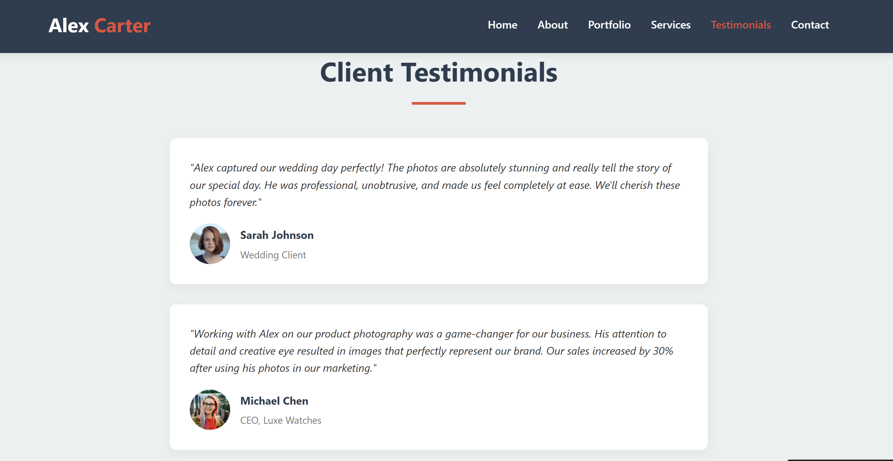

# Photographer Profile Website

This is a responsive portfolio website for a freelance photographer. It showcases photography services, portfolio, testimonials, and contact information.

## Features

- **Responsive Design:** Works on desktop, tablet, and mobile devices.
- **Portfolio Filtering:** View photos by category (Portrait, Wedding, Landscape, Commercial).
- **Smooth Scrolling Navigation:** Easy navigation between sections.
- **Mobile Menu:** Hamburger menu for mobile devices.
- **Contact Form:** Collects user inquiries (front-end only).
- **Font Awesome Icons:** For visual enhancement.

## Sections

- **Hero:** Introduction and call-to-action.
- **About:** Photographer's bio and skills.
- **Portfolio:** Gallery with filter buttons.
- **Services:** List of photography services.
- **Testimonials:** Client feedback.
- **Contact:** Contact details, social links, and a form.
- **Footer:** Copyright.

## Getting Started

1. **Clone or Download** this repository.
2. **Open `new.html`** in your browser to view the website.

## Customization

- Update images, text, and contact details in [`new.html`](new.html) as needed.
- Modify styles directly in the `<style>` tag in the `<head>` section.

## Live Preview

To preview locally with Live Server in VS Code:
1. Install the [Live Server extension](https://marketplace.visualstudio.com/items?itemName=ritwickdey.LiveServer).
2. Right-click `new.html` and select **Open with Live Server**.

## License

This project is for personal and portfolio use. Replace content and images as needed for your own profile.